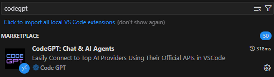
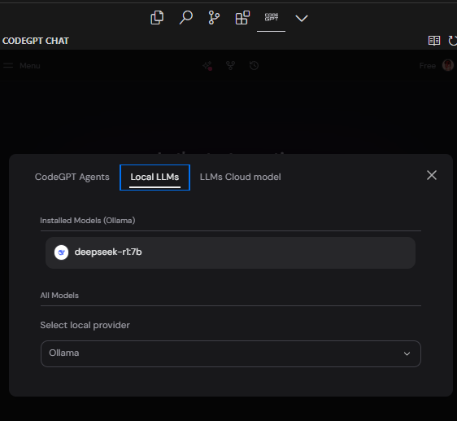

# ollama-deepseek-openwebui-cursor
HOWTO guide on how to deploy deepseek-r1 locally (Windows 11 / WSL2) and use it with Cursor.
Prerequisites:
- Windows 11
- WSL2 (with latest kernel)
- Nvidia GPU (tested with RTX 4060)

## Install cuda
Follow all steps in https://docs.nvidia.com/cuda/wsl-user-guide/index.html#getting-started-with-cuda-on-wsl-2
and https://developer.nvidia.com/cuda-downloads?target_os=Linux&target_arch=x86_64&Distribution=WSL-Ubuntu&target_version=2.0&target_type=deb_local

```bash 
wget https://developer.download.nvidia.com/compute/cuda/repos/wsl-ubuntu/x86_64/cuda-wsl-ubuntu.pin
sudo mv cuda-wsl-ubuntu.pin /etc/apt/preferences.d/cuda-repository-pin-600
wget https://developer.download.nvidia.com/compute/cuda/12.8.0/local_installers/cuda-repo-wsl-ubuntu-12-8-local_12.8.0-1_amd64.deb
sudo dpkg -i cuda-repo-wsl-ubuntu-12-8-local_12.8.0-1_amd64.deb
sudo cp /var/cuda-repo-wsl-ubuntu-12-8-local/cuda-*-keyring.gpg /usr/share/keyrings/
sudo apt-get update
sudo apt-get -y install cuda-toolkit-12-8
```

## Install Docker
```bash
sudo apt install -y curl
sudo apt-get update
sudo apt-get -y install apt-transport-https ca-certificates curl gnupg-agent software-properties-common
curl -fsSL https://download.docker.com/linux/ubuntu/gpg | sudo apt-key add -
sudo apt-key fingerprint 0EBFCD88
sudo add-apt-repository "deb [arch=amd64] https://download.docker.com/linux/ubuntu $(lsb_release -cs) stable"
sudo apt-get update
sudo apt-get -y install docker-ce docker-ce-cli containerd.io
sudo apt-get -y install docker-compose-plugin
```

## Install container-toolkit (https://docs.nvidia.com/datacenter/cloud-native/container-toolkit/latest/install-guide.html)
```bash
curl -fsSL https://nvidia.github.io/libnvidia-container/gpgkey | sudo gpg --dearmor -o /usr/share/keyrings/nvidia-container-toolkit-keyring.gpg \
  && curl -s -L https://nvidia.github.io/libnvidia-container/stable/deb/nvidia-container-toolkit.list | \
    sed 's#deb https://#deb [signed-by=/usr/share/keyrings/nvidia-container-toolkit-keyring.gpg] https://#g' | \
    sudo tee /etc/apt/sources.list.d/nvidia-container-toolkit.list
sed -i -e '/experimental/ s/^#//g' /etc/apt/sources.list.d/nvidia-container-toolkit.list
sudo apt update && sudo apt upgrade
sudo mv cuda-wsl-ubuntu.pin /etc/apt/preferences.d/cuda-repository-pin-600
sudo apt-get update
sudo apt-get -y install cuda-toolkit-12-8
```

## Install ollama
```bash
curl -fsSL https://ollama.com/install.sh | sh
```

## Run ollama serve (11434)
```bash
ollama serve
```

## Download deepseek into ollama
```bash
ollama run deepseek-r1:7b
```

## Run open-webui
```bash
docker run -d --network=host --runtime=nvidia --gpus all --add-host=host.docker.internal:host-gateway -v open-webui:/app/backend/data --name open-webui --restart always ghcr.io/open-webui/open-webui:cuda
```

## In order to use Cursor, we need to use extension CodeGPT
Install it in the extension marketplace:



And configure settings to point to local ollama instance:



## Outdated - DOES NOT WORK
Windows 11 / WSL2 cannot access host.docker.internal regardless doing port forwarding, etc

## Powershell
```bash
netsh interface portproxy delete v4tov4 listenport="11434" # Delete any existing port 11434 forwarding
$wslIp=(wsl -d Ubuntu -e sh -c "ip addr show eth0 | grep 'inet\b' | awk '{print `$2}' | cut -d/ -f1") # Get the private IP of the WSL2 instance
netsh interface portproxy add v4tov4 listenport="11434" connectaddress="$wslIp" connectport="11434"
```

## Run open-webui on port 3000
```bash
#docker run -d -p 3000:8080 --add-host=host.docker.internal:host-gateway -v open-webui:/app/backend/data --name open-webui --restart always ghcr.io/open-webui/open-webui:cuda
#docker run -d --network=host --runtime=nvidia --gpus all --add-host=host.docker.internal:host-gateway -v open-webui:/app/backend/data --name open-webui --restart always ghcr.io/open-webui/open-webui:cuda
```